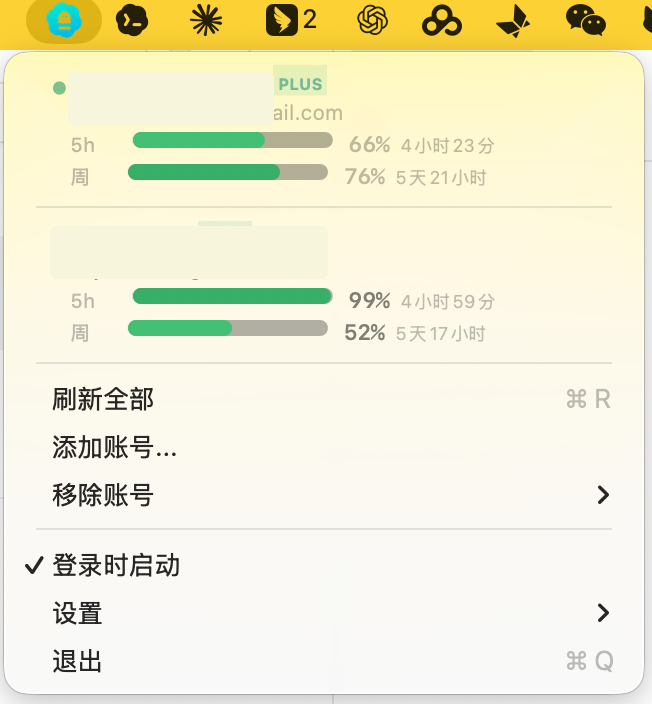

# Codex Switch

在菜单栏中切换多个 Codex 账号，并快速查看额度使用情况。

<p align="center">
  
</p>

## 安装

**[下载 DMG](../../releases/latest)** · 解压后拖到 Applications 即可。

> 需要 macOS 12+，并已安装 [Codex](https://openai.com/codex)。首次使用前请先运行 `codex login` 登录。

## 从源码构建

```bash
git clone https://github.com/jieguangzhou/CodexSwitcher.git
cd CodexSwitcher
bash build.sh
open CodexSwitcher.app
```

## 添加另一个账号

在菜单栏应用中点击 **Add Account...**。CodexSwitcher 会先保存当前的
`~/.codex/auth.json`，再把它临时移走，并打开终端运行：

```bash
codex login
```

添加另一个账号时不要运行 `codex logout`。退出登录可能会让当前 token 失效；CodexSwitcher
只移动认证文件，因此已保存的账号之后仍可以切换回来。

## 功能

- **一键切换账号**：直接从菜单栏切换 Codex 账号
- **查看所有账号额度**：用进度条展示 5 小时窗口和每周额度
- **低额度提醒**：额度不足时改变菜单栏图标，并发送系统通知
- **自动同步**：执行 `codex login` 后自动发现新账号
- **零配置使用**：开箱即用，设置项可在菜单中调整

## 许可证

MIT
